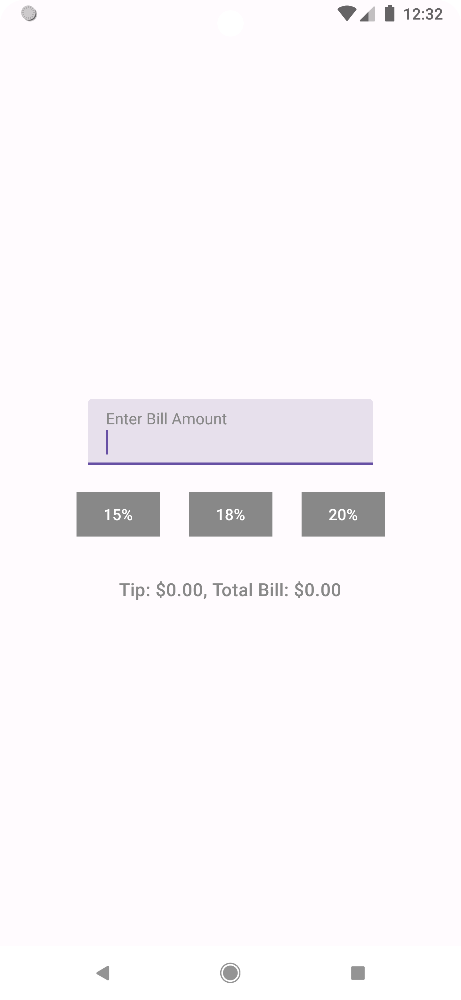
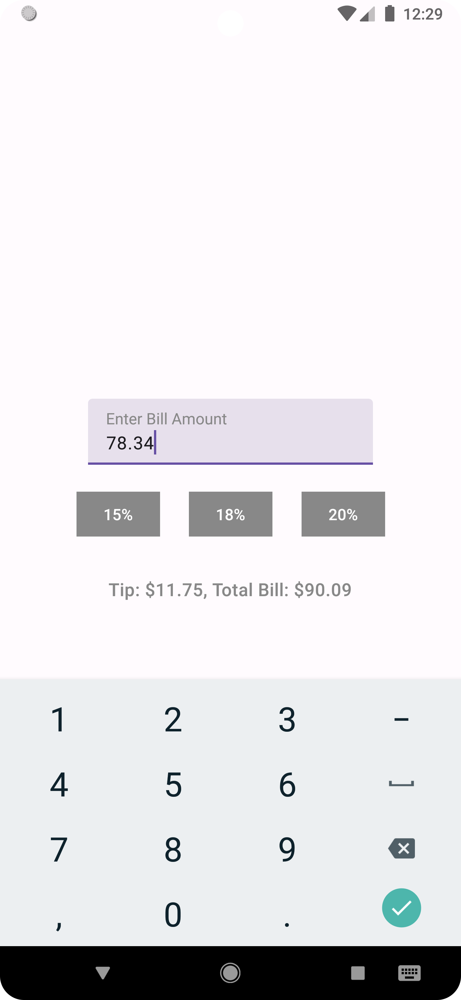

# Tip Calculator

**Tip Calculator** is a **simple Android app** built with **Jetpack Compose** that allows users to quickly calculate the tip and total bill for any restaurant bill.  
It demonstrates modern Android development practices, including **Compose UI**, **state management**, and **declarative layouts**.

---

## Table of Contents

- [Features](#features)
- [Screenshots](#screenshots)
- [Installation](#installation)
- [Usage](#usage)
- [Dependencies](#dependencies)

---

## Features

- Enter the bill amount.  
- Quickly calculate tips using **preset buttons** (15%, 18%, 20%).  
- View both **tip amount** and **total bill** instantly.  
- Simple and clean **Material 3 UI**.  
- Works on devices with **Android 7.0 (API 24)** and above.

---

## Screenshots

<p float="left">
  
  
</p>

*Main Screen (left) showing input field and tip calculation buttons. Tip Calculation Screen (right) showing calculated 15% tip and total bill amount.*
---

## Installation

1. Clone the repository:
```bash
git clone https://github.com/yourusername/MealRater.git
```
2. Open the project in **Android Studio**.  
3. Make sure your Android SDK is set to **API 34** or higher.  
4. Build and run the app on an emulator or device running **Android 7.0 (API 24)** or higher.

---

## Usage

1. Launch the app.  
2. Enter the **bill amount** in the text field.  
3. Tap one of the **tip percentage buttons** (15%, 18%, 20%).  
4. The app will instantly display:
   - **Tip amount**  
   - **Total bill**  

---

## Dependencies

Key dependencies:

- **Jetpack Compose** (Material 3, UI, UI Tooling)  
- **Compose activity integration** (`activity-compose`)  
- **AndroidX Core KTX, AppCompat, ConstraintLayout**  
- **JUnit & Espresso** for testing  

Full versions are defined in `build.gradle`.

---
